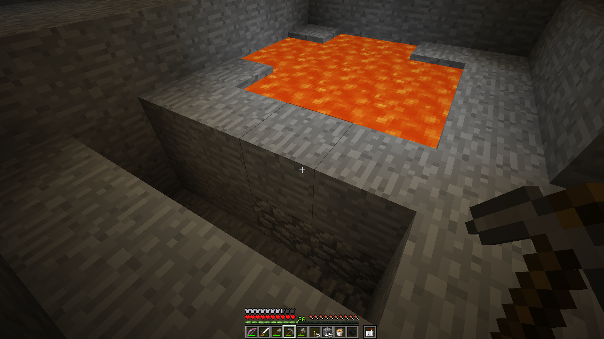
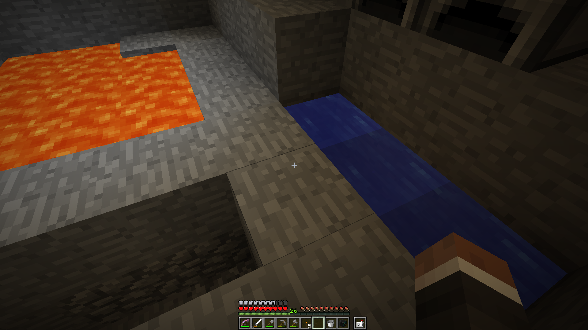
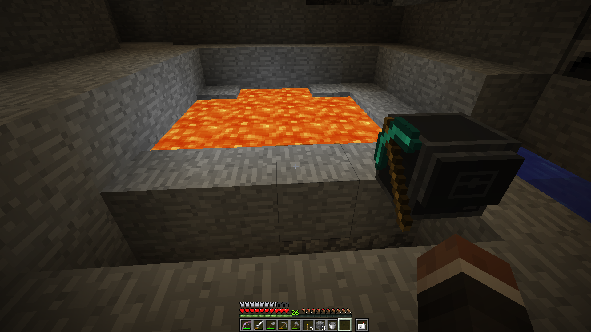
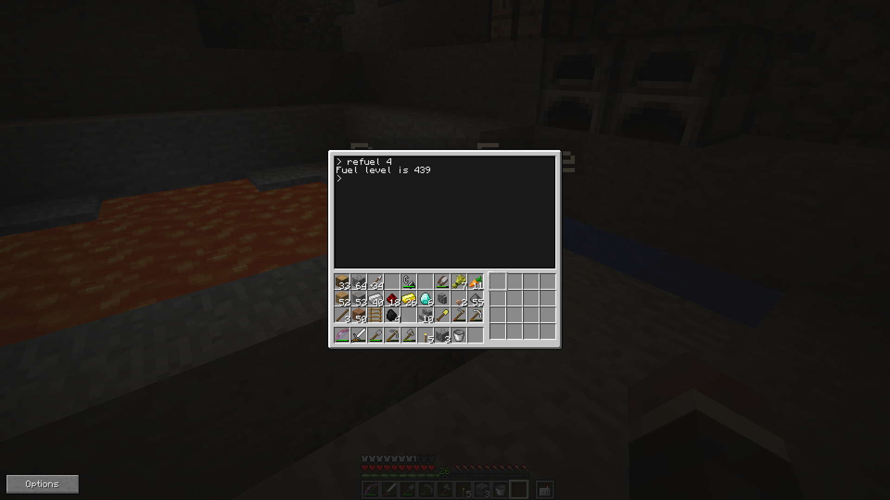
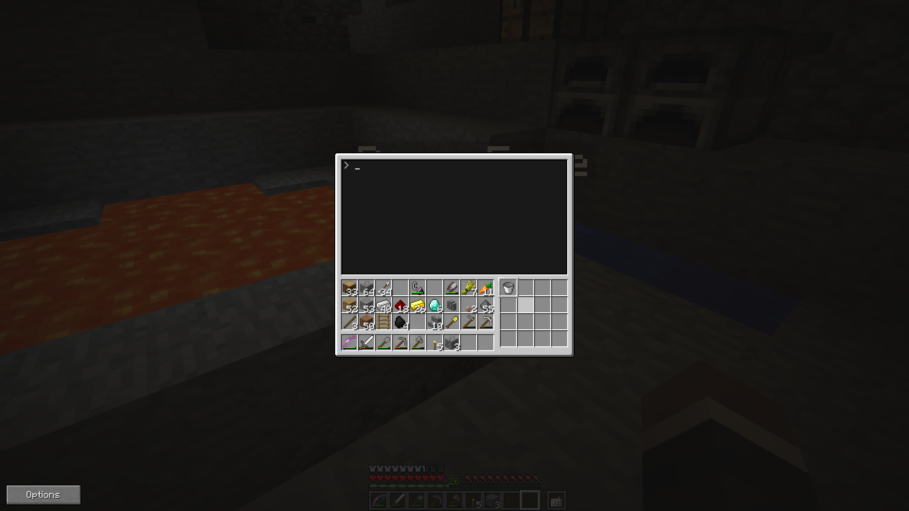

# Why and How

The purpose of obbyMiner is to make
obsidian-mining safer and less boring.

<iframe width="560" height="315" 
src="https://www.youtube.com/embed/hCrqiZm8ShQ?rel=0&amp;showinfo=0" 
frameborder="0" allowfullscreen>
</iframe>

## Before You Run It
When I say left or right, I'm assuming 
you're facing the lava pool, from 
behind where the robot starts. Follow
these five steps to prepare:

1) Dig a groove two blocks deep next
to the lava. If the groove is less than
11 blocks long, make an obstruction at 
the left end.  Don't bother to make 
the groove any longer than 11 blocks.

2) Make an infinite water source one 
block away from the right end of the 
groove.

3) Place the turtle and move it above 
the right-most groove position.

4) Assuming fuel is needed for robots
in your server/world, refuel the robot 
and be generous about it. I would fill
it to hundreds or even a thousand units.
You can use the [refuel](http://www.computercraft.info/wiki/Refuel) program built in to turtles.

5) Put a bucket into the turtle's 
selected slot, number 1 by default.

## Other Limits and Notes: Please Keep Reading

The maximum distance for collecting 
lava from the pool is 50 blocks.  *If
you want to adjust this, edit the file
and look for MXLTH.

You may not be able to use this script 
on a server running the Essentials 
plug-in, unless you can convince the 
owner to allow lava placement in the 
file plugins/Essentials/config.yml,
like so:

	...
	# 10 = lava :: 11 = still lava :: 46 = TNT :: 327 = lava bucket
	...
	blacklist:

    # Which blocks should people be prevented from placing?
    placement: # 10,11,46,327

    # Which items should people be prevented from using?
    usage: # 327

Also, if you're using grief protection
and you've claimed the area where the 
lava sits, you'll have to temporarily
abandon the claim to run this script.

\* MXLTH adjustment is a good idea
when the pool is very small, because
the number is used for estimating the
fuel needed for return and finishing.
If the fuel is considered low, the 
program will stop lava collection and 
finish up anything currently in the
groove.  This is to prevent the 
dangerous situation where the robot has
halted while sitting above the middle 
of a large lava lake. 